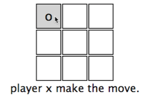
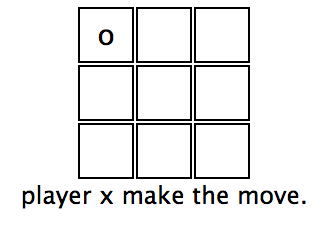
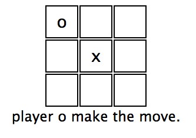

# Networked multiplayer Tic Tac Toe challenge

In this challenge you will build a networked multiplayer Tic Tac Toe game.

This means two different users on two different clients should be able to navigate to the game and play Tic Tac Toe against each other in real-time.

Below is an example of the kind of multiplayer behavior we are looking for.

#### Game Initialization:
User 1 and User 2 navigate to game link and see an empty Tic Tac Toe board.

#### Move-1: 
User 1 clicks on a square and it fills with an O. User 2 sees this O appear in realtime.

User 1 client:

User 2 client:

#### Move-2: 
User 2 clicks on a square and it fills with an X. User 1 sees this X appear in realtime.

User 2 client:

User 1 client:

### Details:
You are free to use whatever language, stack, framework, library, package or technology you want. The purpose of this challenge is to demonstrate how you approach a complex problem and architect a simple, concise solution. There are many different ways you could approach this problem. You could use WebSockets or poll the server. You could use a Node server or a Sinatra server or even go serverless. You could use React or some plain JavaScript. You are in total control of the technology used to solve this challenge. 

The game look and behavior is up to you. The images above are an example of the real-time multiplayer functionality we are looking for.

This challenge has a self-enforced time limit of 4 hours. If you have reached the 4 hour mark and have not completed the challenge, submit what you have completed. We are not looking for a production Tic Tac Toe platform that can handle 5 million unique hits a second. Please keep the end product lean and simple.

### Deliverable:
1) Reply to our email with the link to the Github repo where your solution is located.
2) Be prepared to demo and explain your solution in an in-person interview.

